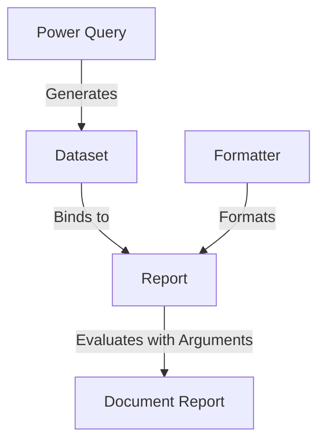

# HCR Components & Glossary

This page provides an overview of the core architectural components of Hope Country Report (HCR) and defines key terms.

---

## Core Components

The HCR reporting pipeline connects data queries, formatters, and reports into a cohesive workflow.

### 1. Power Query
A read-only query executed on the database to generate a dataset.
- **Target**: The core model from which the query execution starts.
- **Code**: The Python script containing the database query logic.
  - The variable `result` must contain the final dataset.
  - The variable `extra` contains any additional context metadata.
- **Attributes**:
  - `active`: Indicates if the query is currently active and can be run.
  - `daily refreshed`: Specifies if the query is scheduled to refresh its data automatically every day.

### 2. Formatter
A template used to display, render, or export reports.
- **Content Type**: The target file output format (e.g., `PDF`, `DOC`, `XLS`, `TXT`, or `CSV`).
- **Code**: The template/formatting code used to render the final output.

### 3. Dataset
The dictionary of retrieved data produced by executing a **Power Query**. Each dataset maintains a reference to the query that generated it.

### 4. Report
The model that binds a **Power Query**, a **Dataset**, and a **Formatter** together to define a report template.

### 5. Document Report
A finalized, concrete document instance obtained by evaluating a **Report** for a specific combination of arguments.

---

## Glossary & Concepts

### Arguments & Parameters
- **Argument**: Parameters (filters or inputs) passed to the report parser (e.g., `<report:Parametrizer/Argument>`).
- **System Flagged**: Special arguments that trigger related synchronization events or background tasks when evaluated.

### Access & Security
Access to reports and data fields is restricted based on two main criteria:
1. **Business Area**: Access is granted based on the Business Area associated with the user's Group (giving them *PowerQuery Viewer* permissions).
2. **Limited Access**: Granular restrictions can be set to limit visibility of specific fields within a report.
