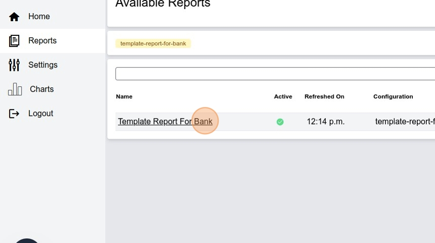

# Creating a Template Report for a Bank in Belarus


1\. Navigate to [https://reporting-hope-dev.unitst.org/admin/](https://reporting-hope-dev.unitst.org/admin/)


2\. Scroll down to "Queries"


3\. Click on "ADD QUERY"


4\. Add "Belarus" to country office field


5\. Fill in the name of the query "Template for a bank"


6\. Paste this code in order to get the required information. 

```python
from django.db.models import ExpressionWrapper, F, DecimalField
households=list(conn.select_related(
"head_of_household",
"business_area",
"parent",
"household"
).filter(
    business_area__slug="belarus",
    parent__unicef_id="PP-0630-24-00000017"
).values(
"entitlement_quantity",
"head_of_household__given_name",
"head_of_household__given_name",
"head_of_household__family_name",
"head_of_household__middle_name",
"head_of_household__sex",
"household__address",
"head_of_household__phone_no",
"household__unicef_id"
).annotate(
    commission=ExpressionWrapper((F('entitlement_quantity')*5/100)*1.20, output_field=DecimalField(decimal_places=2) ))
)
result = []
for household in households:
    address_no_spaces = household["household__address"].replace(" ", "")
    household["locality"] = address_no_spaces[:29]
    household["street_name"] = address_no_spaces[30:59]
result.append(household)
```


7\. We will produce a report based on the Payments made recently in Belarus. So, we chose the **Payment**, table as target of our report.


8\. Save and continue editing.


9\. Click "Queue" button to generate the data.


10\. Click "DATASETS" to preview the results and ensure things are correct


11\. We now need to create a formater as requested by the bank. This will allow us to produce a text file that ressemble the one we required by our bank. Navigate to ***Home>Power*** Query and slick "**Add**" on the formater row


12\. Give the template a name "Template for a bank in Belarus"


13\. Click here.


14\. In the code area, paste the following html code:
```html
<table></table>
```


15\. Select the "text/html" option for the hile type since we want a simple html file. Save.


16\. Go back to the **Menu > Power Query** and add a Report Configuration


17\. Don't forget to chose the country office the report belongs to. Chose the report title and the appropriate query.


18\. Click "Template for a bank in Belarus" as formatter and move it to the **Chosen formatters.**


19\. Click "Choose"


20\. Save.


21\. And  "Queue" in order to generate the requested template


22\. Click "VIEW ON SITE" if you want to look at the result.


23\. Click "view"


24\. Click "Template Report For Bank"


