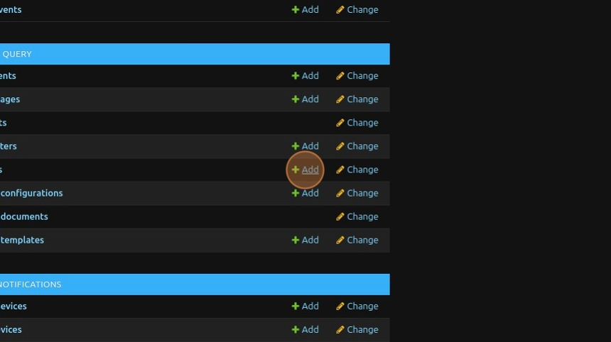
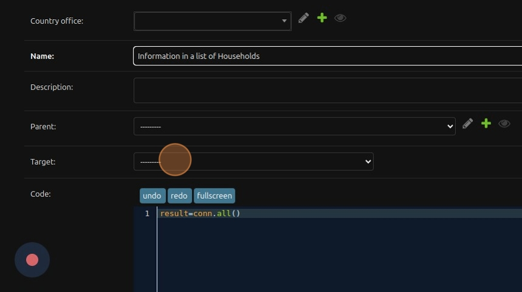
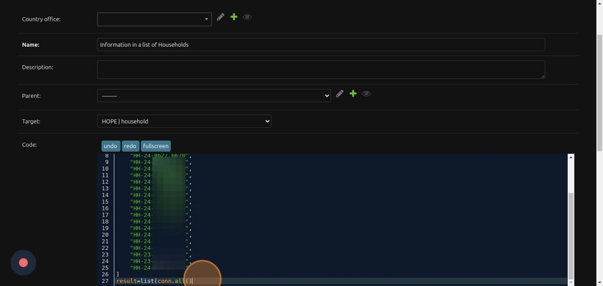
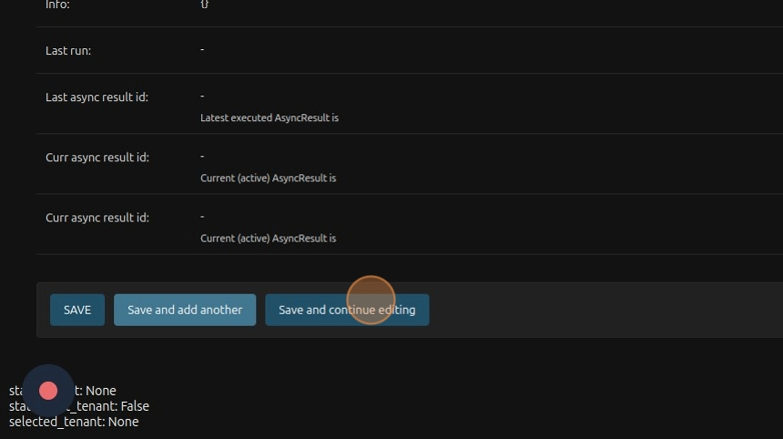
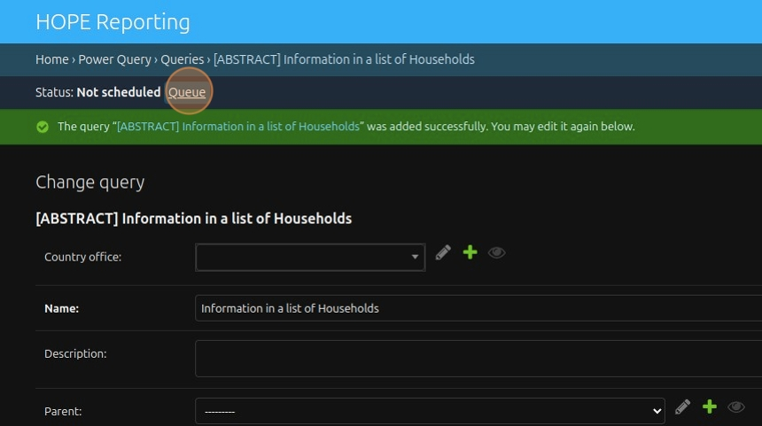
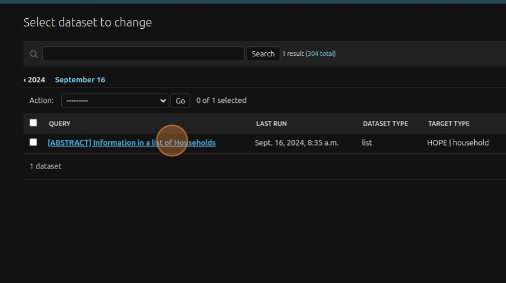
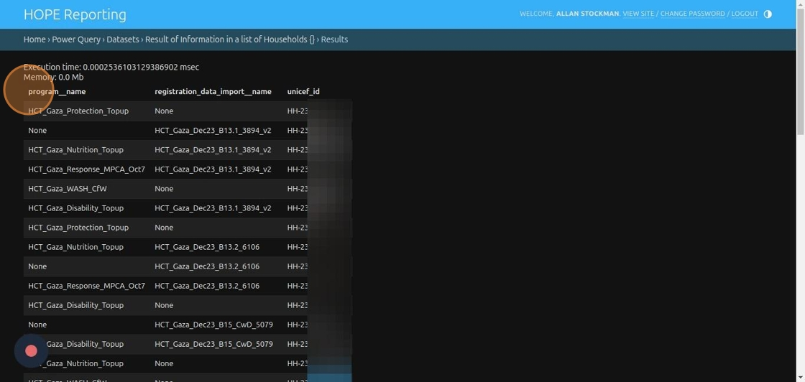

# Generate a report on information related to a list of households


1\. Navigate to [https://reporting-hope-dev.unitst.org/admin/](https://reporting-hope-dev.unitst.org/admin/)


2\. Click "Add"




3\. Type "Information in a list of Households" in the "Name" field.


4\. Click the "Target" field and select "Household".




5\.
```python
hh_list= [
    "HH-23-0271.6128",
    "HH-23-0271.6129",
    ".......",
    "HH-24-2546.2547"
]
result=list(conn.filter(unicef_id__in=hh_list).values("unicef_id", "program__name", "registration_data_import__name"))
```
Paste the list into the `hh_list` variable and filter the query for households in that list.




6\. Click "Save and continue editing".




7\. Click "Queue".




8\. Click "DATASETS".




9\. Click "[ABSTRACT] Information in a list of Households".




10\. Click "PREVIEW" to view the data.


