# Generate Payment Plans Report from a template

1\. Navigate to [https://reporting-hope-dev.unitst.org/admin/](https://reporting-hope-dev.unitst.org/admin/)


2\. Add a query

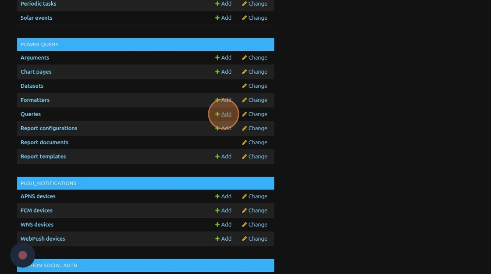


3\. In the **Parent** field, you have to choose the report template that you want to use. It must use Parameters so that you can substitute new ones. The target and code fields _must be empty_, but the "Country" and "Parent" fields must be set.

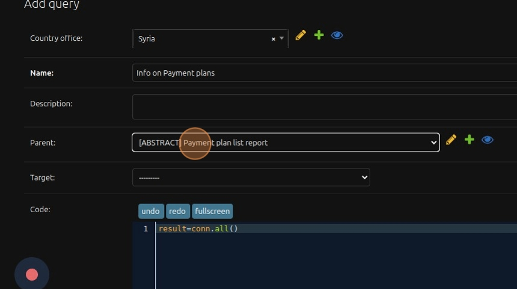


4\. Delete anything in the code field  `result=conn.all()`

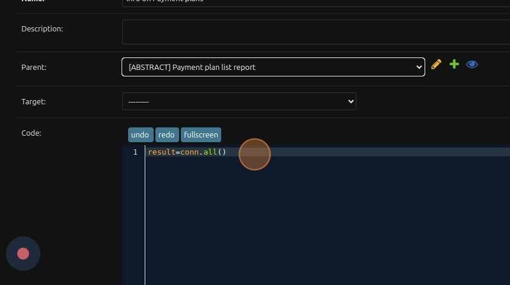


5\. Click the "Parametrizer" dropdown.

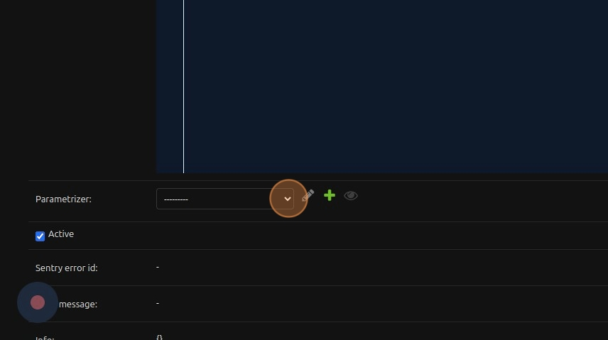


6\. You can choose any parameter or create one by clicking on the "+" sign.

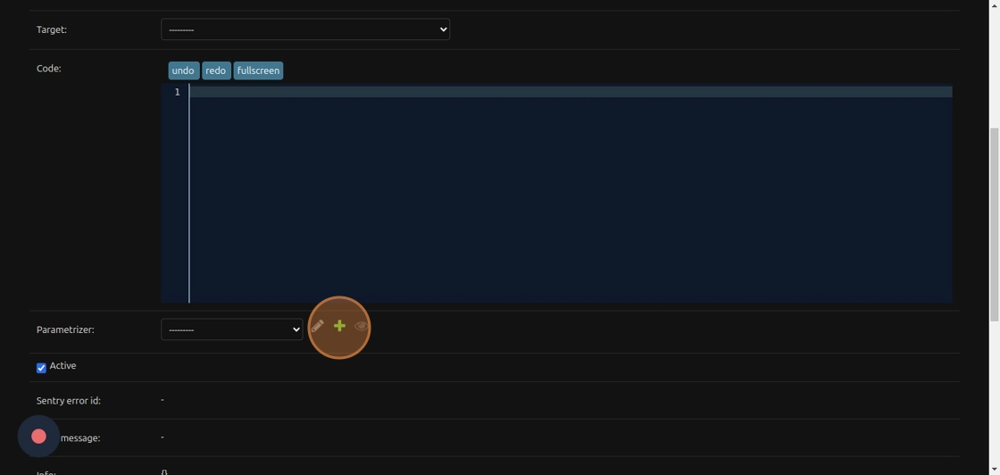


7\. Choose a name and a country.

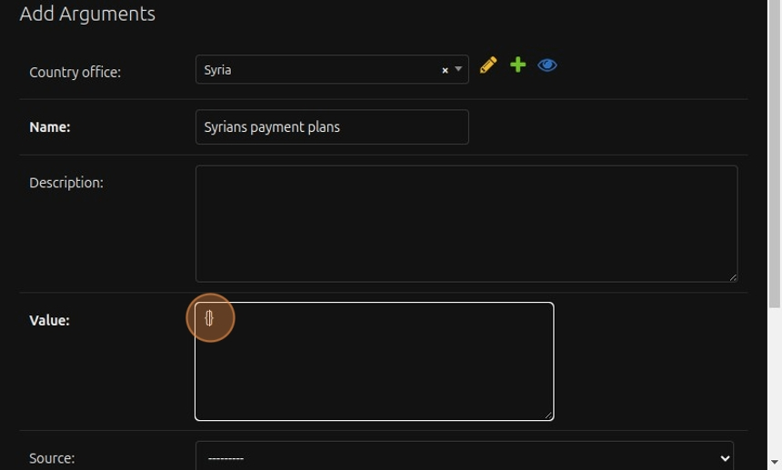


8\. Fill the "Value" field with the correct JSON information:

```json
{"payment_plan": ["PP-4140-24-00000056", "PP-4140-24-00000055", "PP-4140-24-00000049", "PP-4140-24-00000046"], "business_area": ["syria"]}
```

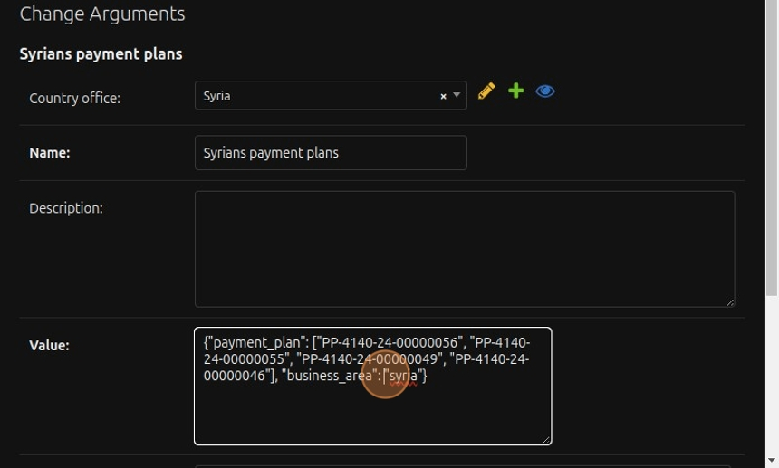


9\. Save the parameters

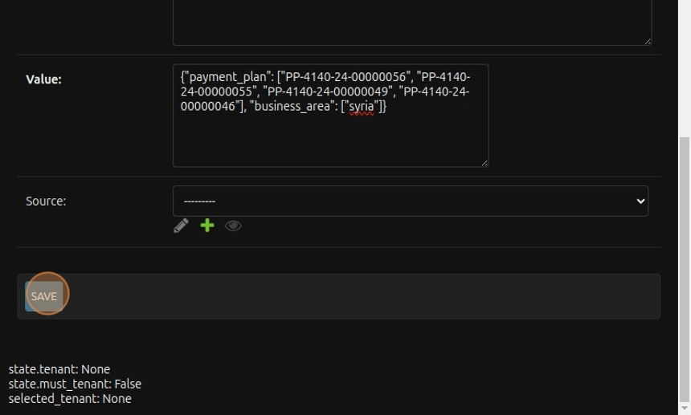


10\. Click this button.

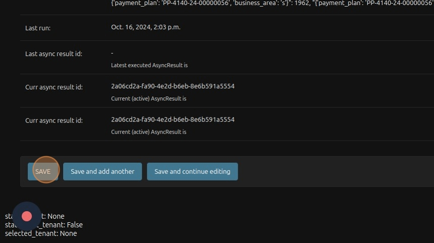


11\. Click "Info on Payment plans (Payment plan list report)"

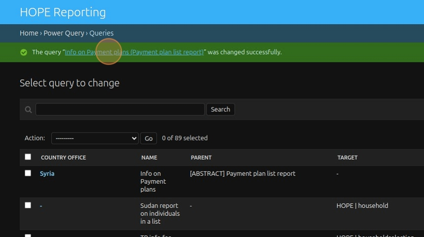


12\. Click "Queue"

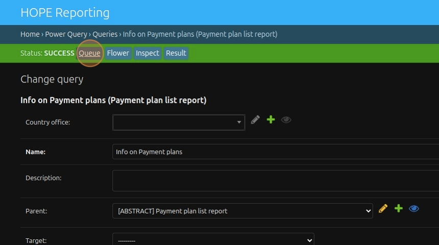


13\. Go back and we create the report configurations

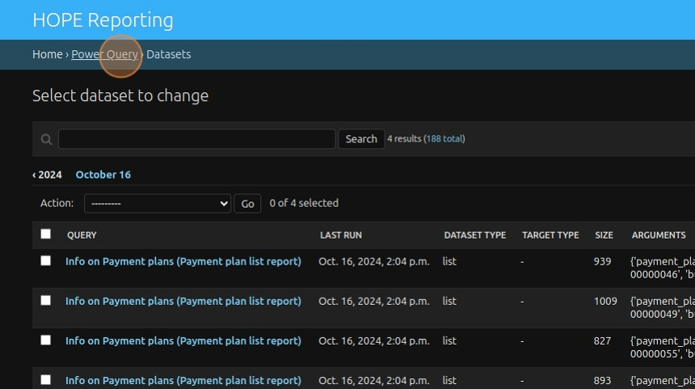


14\. Select the country

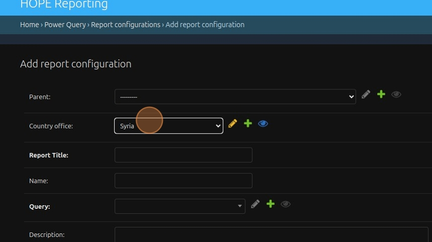


15\. Click "Info on Payment plans (Payment plan list report)" as the query

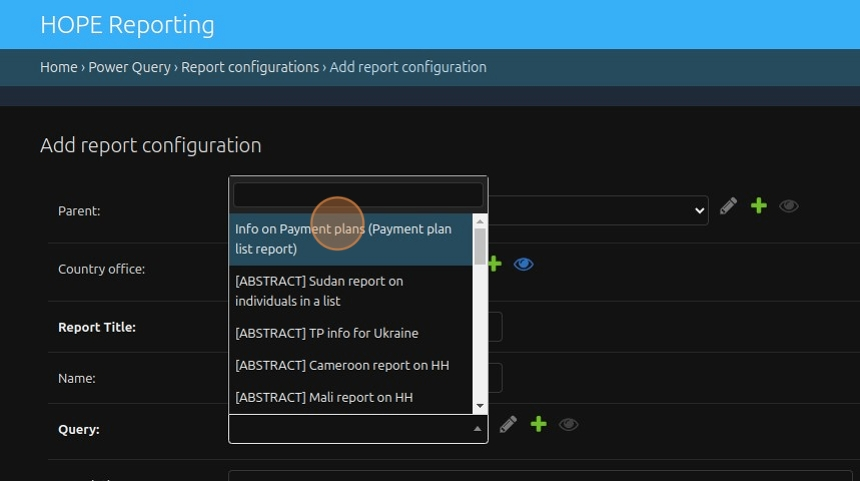


16\. Choose for the report to be available as an Excel and HTML file.

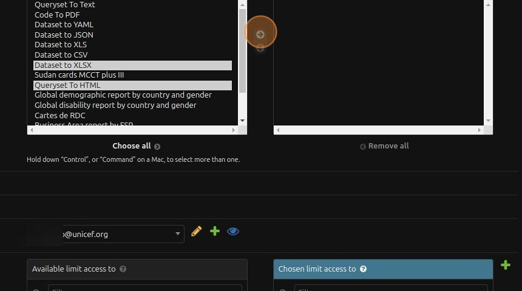


17\. You can choose to limit access to or notify "[dzzzdzzzz@unicef.org](mailto:dzzzzzzzz@unicef.org)".

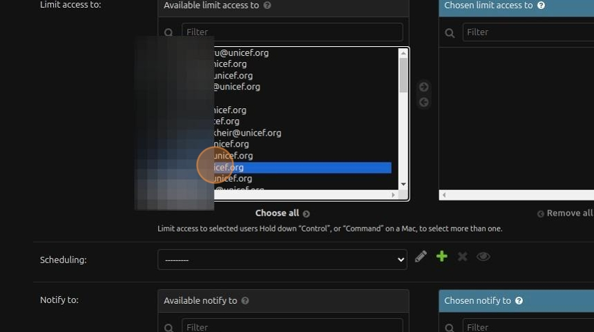


18\. Click the "Compress" field if you want the report to be available as a compressed file.

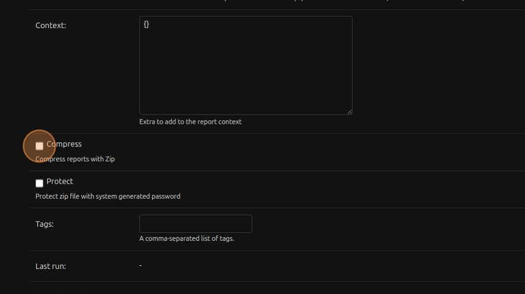


19\. Save and continue editing, and  queue the report.

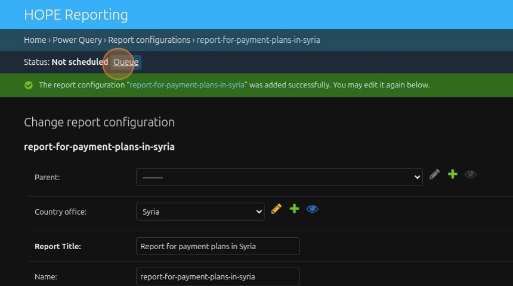


20\. Click "VIEW ON SITE" to view the result

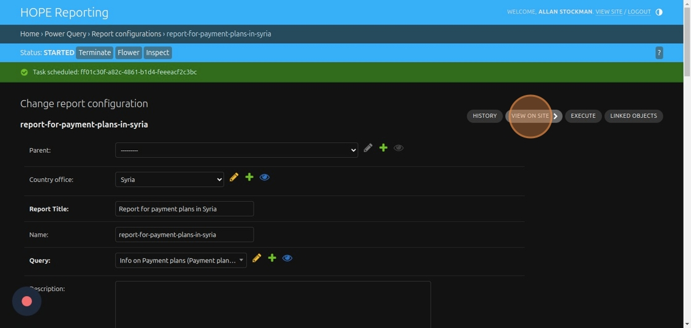


21\. Click "view"

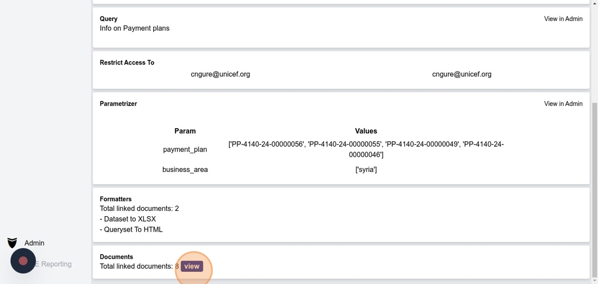


22\. Click "Report For Payment Plans In Syriapp-4140-24-00000056_Syria"

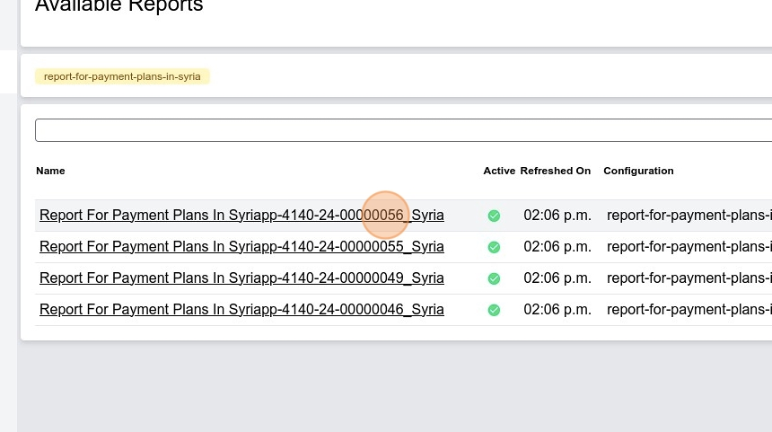
