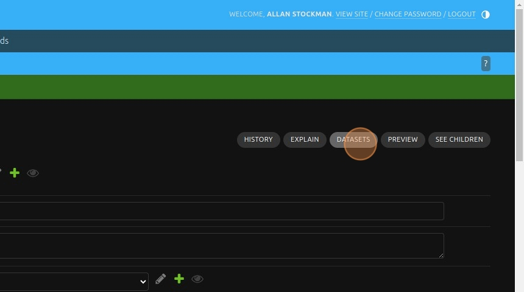

# Creating reports


1\. Navigate to [https://reporting-hope-dev.unitst.org/admin/](https://reporting-hope-dev.unitst.org/admin/)


2\. Scroll down and click "Queries"


3\. Click "ADD QUERY"


4\. Click here.


5\. Right-click "Afghanistan"


6\. Click the "Name:" field.


7\. Type the name of the query e.g "Afghan query for all households"


8\. Click the "**Target**" drop-down menu. It designate which table you are going to be using to query the database. For our case we will use the **Household** table.


Alert: The list of tables available in the Hope project can be viewed on this [link](https://github.com/unicef/hope-country-report/blob/develop/src/hope_country_report/apps/hope/models/%5C_inspect.py). The link between different tables and how to retrieve information from one table to another is part of the [Django documentation](https://www.djangoproject.com/).


9\. Start typing the code for the query. Remember, here **conn** represent ***conn=Household.objects***. Please refer to [Django](https://www.djangoproject.com/).


10\. 
```python
result = list(conn.filter(withdrawn=False, first_registration_date__year__gte=2024).values("unicef_id", "admin1__name"))
```

Here we will query the list of households which are not withdrawn and were registered in 2024 or above. We will only retrieve their **unicef_id** and **Admin1** area name. The query must return data that we must assign to the **result** environment variable.


11\. We then save and continue editing


12\. Click "Queue" to launch the retrieval of the data.


13\. If you want to preview the result, click "DATASETS" button.




14\. Click  on the query "\[ABSTRACT\] Afghan query for all households"


15\. And preview "PREVIEW". You should see that your report is OK.


16\. Click  on the navigation link "Power Query" so that we can produce the actual report in its format.


17\. Click "Add" on the Report Configuration


18\. Click this drop-down and chose which country office the report will bellong to.


19\. Fill in the "Report Title:" field. "Repport on Afghan households in 2024"


20\. Click here.


21\. Search for the query you previously created by typing "afgh".


22\. Click "[ABSTRACT] Afghan query for all households"


23\. Add "Queryset To HTML" if you want to see the report as an html page and file.


24\. Add "Dataset to XLSX" if you want to see the report as an Excel file.


25\. Click "Choose" and move them on the other side.


26\. Save and continue editing.


27\. Click "Queue" to generate the actual reports.


28\. Click "VIEW ON SITE" in order to view the resulting reports.


29\. Click "view"


